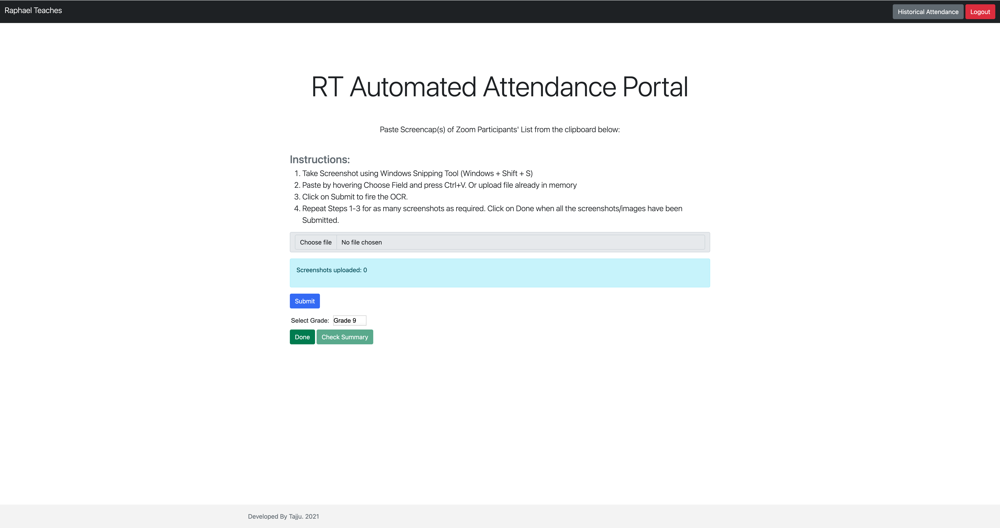

# Raphael Teaches Online Classes - Attendance Tracker (Discontinued)

**Note:** This project is no longer maintained and has been discontinued since 2021.

## Overview

This project served as an attendance tracker for online classes conducted by Raphael Teaches. The primary functionality involved processing screenshots of Zoom meeting participants, extracting names using pytesseract OCR, and then matching them with registered students in the database. The system marked students as present or absent based on the matching results.

## Key Features

1. **Screenshot Processing:**
   - Teachers' assistants could upload screenshots of Zoom meeting participants for attendance tracking.

2. **Name Extraction and Matching:**
   - Utilized pytesseract OCR to convert names from screenshots into text.
   - Implemented a custom algorithm to clean up and process the extracted names.
   - Matched the names with the registered students in the database.

3. **Attendance Confirmation:**
   - The system marked identified names as present and the rest as absent.
   - Provided a confirmation page for administrators to manually check or uncheck student attendance.

4. **Integration with Google Sheets API:**
   - Utilized Google Sheets API for tracking student attendance.
   - Data fetched and posted to a Google Sheets document for attendance records.

5. **Support for In-person Classes:**
   - Scope for manually inputting attendance for in-person physical classes.

## Discontinuation

This project was last updated in 2021 and is no longer actively maintained. Users are encouraged to explore alternative solutions for their attendance tracking needs.

## Getting Started

As the project is no longer actively maintained, setting it up is not recommended. Consider exploring other attendance tracking solutions for your requirements.

